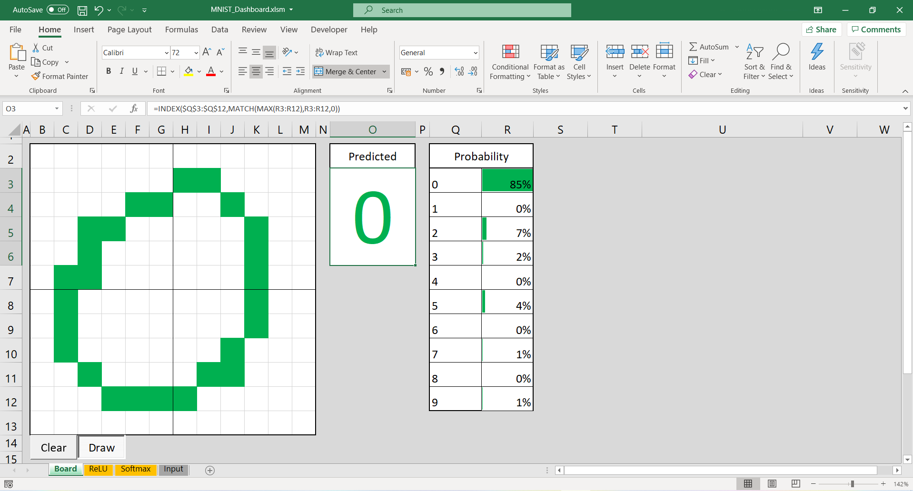

## Multiclass classification in Excel using neural network

Hey guys, this is a quick proof of concept project which aims to train a simple multiclass classification neural network and deploy it in Excel.
Such deployment can be useful in corporate environments with rigid system integration processes.

The Excel [file](MNIST_Dashboard.xlsm) allows you to draw by clicking on individual cells on the 'board', while the neural network performs prediction in real time. [Try](MNIST_Dashboard.xlsm) it yourself!

## Description

The neural network consists of densely connected ReLU and Softmax layers, trained on modified MNIST dataset. The exported weights are then converted into .csv file, which can be easily opened in Excel.

Each layer 'lives' on a separate Excel sheet, and their outputs are calculated purely using Excel formulas. This allows the model to be deployed on any device capable of running Excel; including iOS & Android devices, or even through web browser (https://office.live.com/).

*Training*
  1. **Python**, using **Keras** deep learning library

*Excel*
  1. **VBA** (frontend)
  2. **_only_ Excel formulas** (backend)

